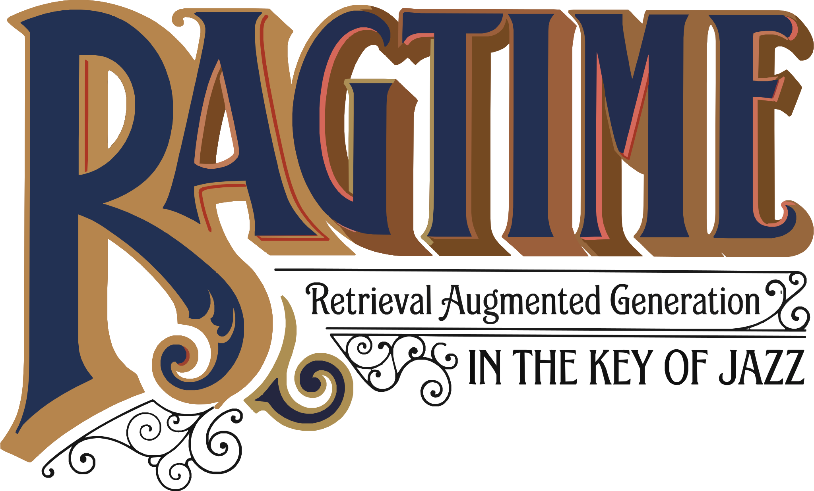

<div align="center">
  <picture>
    
  </picture>
  <br>
  <sub>Image generated with <a href="https://gemini.google/overview/image-generation/">Nano Banana</a> from the cover of <a href="https://en.wikipedia.org/wiki/Ragtime_(novel)">E.L. Doctorow's novel "Ragtime"</a></sub>
</div>

<br>

<div align="center">

[](https://github.com/rafacm/ragtime/actions/workflows/ci.yml)
[](https://www.python.org/)
[](https://www.djangoproject.com/)
[](LICENSE)

</div>

## What is RAGtime?

RAGtime is a Django application for ingesting jazz-related podcast episodes. It extracts metadata, transcribes audio, identifies jazz entities, and powers **Scott** — a jazz-focused AI agent that answers questions strictly from ingested episode content, with references to specific episodes and timestamps.

## Features

- 🎙️ **Episode Ingestion** — Add podcast episodes by URL. RAGtime scrapes metadata (title, description, date, image), downloads audio, and processes it through the pipeline.
- 📝 **Multilingual Transcription** — Transcribes episodes using configurable backends (Whisper API by default) with segment and word-level timestamps. Supports multiple languages (English, Spanish, German, Swedish, etc.).
- 🔍 **Entity Extraction** — Identifies jazz entities: artists, bands, albums, venues, recording sessions, record labels, years. Entities are resolved against existing records using LLM-based matching.
- 📇 **Episode Indexing** — Splits transcripts into segments and generates multilingual embeddings stored in ChromaDB. Enables cross-language semantic search so Scott can retrieve relevant content regardless of the question's language.
- 🎷 **Scott — Your Jazz AI** — A conversational agent that answers questions strictly from ingested episode content. Scott responds in the user's language and provides references to specific episodes and timestamps. Responses stream in real-time.

## Processing Pipeline

Each step is a standalone module (`episodes/<step>.py`) that updates the episode's `status` field when it completes. A [`post_save` signal](episodes/signals.py) watches for status changes and dispatches the next step as an async [Django Q2](https://django-q2.readthedocs.io/) task — no central orchestrator needed. Any failure sets `status` to `failed` and halts the chain.

### Steps

#### 1. 📥 Submit (status: `pending`)

User submits an episode page URL. Duplicate URLs are rejected.

#### 2. 🕷️ Scrape (status: `scraping`)

Extract metadata (title, description, date, image, audio URL) and detect language via LLM-based structured extraction. Episodes with missing required fields (title or audio URL) are flagged for manual review (`needs_review`).

#### 3. ⬇️ Download (status: `downloading`)

Download the audio file and extract duration.

#### 4. 🎙️ Transcribe (status: `transcribing`)

Send audio to the Whisper API (or a local Whisper-compatible endpoint) for transcription, producing segment and word-level timestamps in the detected language. Files that exceed the configurable size limit (default 25 MB) are [adaptively downsampled](doc/features/adaptive-audio-resize-tiers.md) with ffmpeg — the gentlest settings that fit are chosen based on episode duration, from 128 kbps for slightly oversized files down to 32 kbps for very long episodes.

#### 5. 📋 Summarize (status: `summarizing`)

LLM-generated episode summary in the episode's detected language.

#### 6. ✂️ Chunk (status: `chunking`)

Split transcript into ~150-word chunks along Whisper segment boundaries, with 1-segment overlap.

#### 7. 🔍 Extract (status: `extracting`)

LLM-based entity extraction from the transcript. Entity types (artist, band, album, composition, venue, recording session, label, year, era, city, country, sub-genre, instrument, role) are stored in the database and managed via Django admin. An initial set of 14 types is defined in [`episodes/initial_entity_types.yaml`](episodes/initial_entity_types.yaml) — load them with `uv run python manage.py load_entity_types`. New types can be added through Django admin; existing types can be deactivated (set `is_active = False`) to exclude them from future extractions without deleting historical data. Types that have existing entities cannot be deleted (protected by referential integrity).

#### 8. 🧩 Resolve (status: `resolving`)

Match extracted entities against existing DB records using LLM-based fuzzy matching to prevent duplicates. Creates canonical entity records and links them to episodes.

#### 9. 📐 Embed (status: `embedding`)

Generate multilingual embeddings for transcript chunks and store in ChromaDB.

#### 10. ✅ Ready (status: `ready`)

Episode fully processed and available for Scott to query.

## Tech Stack

- **Runtime**: Python 3.13
- **Framework**: Django 5.2
- **Database**: SQLite
- **Vector Store**: ChromaDB
- **Task Queue**: Django Q2
- **Transcription**: Configurable — Whisper API (default), local Whisper, etc.
- **LLM**: Configurable — Claude (Anthropic), GPT (OpenAI), etc.
- **Embeddings**: Configurable — must support multilingual models for cross-language retrieval
- **Frontend**: Django templates + HTMX + Tailwind CSS
- **Package Manager**: uv

## How Scott Works

Scott is a strict RAG (Retrieval-Augmented Generation) agent:

1. User asks a question in any language
2. The question is embedded using the configured multilingual embedding model
3. Relevant transcript chunks are retrieved from ChromaDB
4. The LLM generates an answer strictly from the retrieved content
5. The response includes references to specific episodes and timestamps
6. If no relevant content exists, Scott says so — no hallucinated answers

Scott responds in the user's language, regardless of the source episode's language. Cross-language retrieval is handled by multilingual embeddings.

## Getting Started

### Prerequisites

- [Python 3.13+](https://www.python.org/downloads/)
- [uv](https://docs.astral.sh/uv/)
- [ffmpeg](https://ffmpeg.org/) (for audio downsampling)
- [wget](https://www.gnu.org/software/wget/) (for audio downloading)

### Installation

```
git clone <repo-url>
cd ragtime
uv sync
uv run python manage.py migrate
uv run python manage.py load_entity_types   # Seed initial entity types
uv run python manage.py configure            # Interactive setup wizard for RAGTIME_* env vars
uv run python manage.py runserver
```

### Configuration

You can run `uv run python manage.py configure` to launch an interactive setup wizard for all `RAGTIME_*` env vars.

Alternatively, copy [`.env.sample`](.env.sample) to `.env` and fill in your values.

## Changelog

This project was developed with [Claude Code](https://docs.anthropic.com/en/docs/claude-code) and reviewed by [Codex](https://openai.com/index/introducing-codex/). See [CHANGELOG.md](CHANGELOG.md) for the full list of implemented features, fixes, implementation plans, feature documentation and session transcripts.

## License

This project is licensed under the MIT License — see the [LICENSE](LICENSE) file for details.
