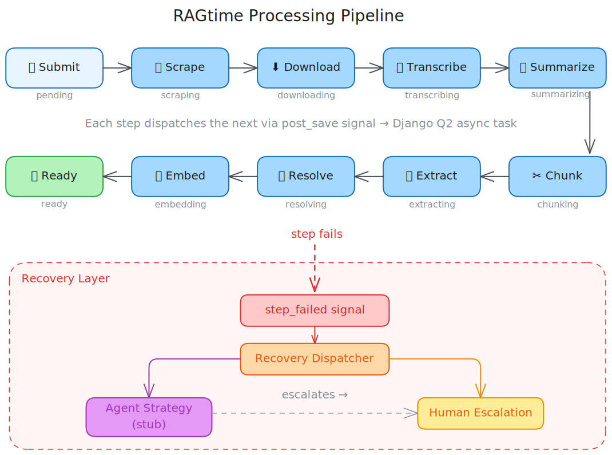
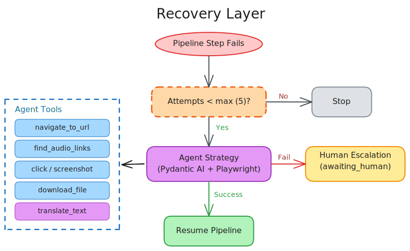

# RAGtime — Detailed Documentation

> Back to [project README](../README.md)

## Table of Contents

- [Processing Pipeline](#processing-pipeline)
  - [Steps](#steps) (1–10)
  - [Recovery](#recovery)
- [How Scott Works](#how-scott-works)
- [Wikidata Cache](#wikidata-cache)
- [LLM Observability (Langfuse)](#llm-observability-langfuse)
- [Feature Documentation](#feature-documentation)

## Processing Pipeline

[](https://app.excalidraw.com/s/3Cob4pHK6Ge/3zFsvWxbOWQ)

Each step is implemented by a dedicated function in the `episodes` package (e.g., [`scraper.scrape_episode`](../episodes/scraper.py), [`downloader.download_episode`](../episodes/downloader.py), [`transcriber.transcribe_episode`](../episodes/transcriber.py)) that updates the episode's `status` field when it completes. A [`post_save` signal](../episodes/signals.py) watches for status changes and dispatches the next step as an async [Django Q2](https://django-q2.readthedocs.io/) task — no central orchestrator needed. Any failure sets `status` to `failed`, emits a structured `step_failed` signal, and triggers the [recovery layer](#recovery) which walks a configurable strategy chain (agent → human escalation).

### Steps

#### 1. 📥 Submit (status: `pending`)

User submits an episode page URL. Duplicate URLs are rejected.

#### 2. 🕷️ Scrape (status: `scraping`)

Extract metadata (title, description, date, image, audio URL) and detect language via LLM-based structured extraction. Episodes with missing required fields (title or audio URL) are marked `failed` and escalated to the recovery layer for human review.

#### 3. ⬇️ Download (status: `downloading`)

Download the audio file and extract duration.

#### 4. 🎙️ Transcribe (status: `transcribing`)

Send audio to the Whisper API (or a local Whisper-compatible endpoint) for transcription, producing segment and word-level timestamps in the detected language. Files that exceed the configurable size limit (default 25 MB) are [adaptively downsampled](features/2026-03-15-adaptive-audio-resize-tiers.md) with ffmpeg — the gentlest settings that fit are chosen based on episode duration, from 128 kbps for slightly oversized files down to 32 kbps for very long episodes.

#### 5. 📋 Summarize (status: `summarizing`)

LLM-generated episode summary in the episode's detected language.

#### 6. ✂️ Chunk (status: `chunking`)

Split transcript into ~150-word chunks along Whisper segment boundaries, with 1-segment overlap.

#### 7. 🔍 Extract entities (status: `extracting`)

**Named Entity Recognition (NER)** — identifies entity mentions in the transcript text.

Runs **per chunk**: each chunk is sent to the LLM independently, which returns the entity names and types it finds. This is a surface-level task — the LLM only needs the chunk's text to spot mentions. Results are stored as raw JSON in `Chunk.entities_json`.

At this stage, no `Entity` or `EntityMention` records are created and no deduplication happens. The same entity may appear under different surface forms across chunks (e.g., "Bird" in chunk 3, "Charlie Parker" in chunk 12).

**Example** — given a chunk containing *"Bird played at Birdland alongside Dizzy Gillespie"*, extraction produces:

| Mention | Type |
|---|---|
| Bird | musician |
| Birdland | music venue |
| Dizzy Gillespie | musician |

**Entity types** (musician, musical group, album, composed musical work, music venue, recording session, record label, year, historical period, city, country, music genre, musical instrument, role) are stored in the database and managed via Django admin. Each entity type has a **[Wikidata](https://www.wikidata.org/) class Q-ID** (e.g., [Q639669](https://www.wikidata.org/wiki/Q639669) for "musician") used for candidate lookup during resolution. An initial set of 14 types is defined in [`episodes/initial_entity_types.yaml`](../episodes/initial_entity_types.yaml) — load them with:

```
uv run python manage.py load_entity_types
```

New types can be added through Django admin; existing types can be deactivated (set `is_active = False`) to exclude them from future extractions without deleting historical data. Types that have existing entities cannot be deleted (protected by referential integrity).

#### 8. 🧩 Resolve entities (status: `resolving`)

**Entity Linking (NEL)** — maps extracted mentions to canonical entity records, deduplicating across chunks.

Aggregates all extracted names across every chunk, then resolves **once per entity type** using LLM-based fuzzy matching against two sources:

1. **Existing DB records** — prevents duplicates when the same entity was seen in a previous episode.
2. **[Wikidata](https://www.wikidata.org/) candidates** — searches by name and type, presenting candidates (with Q-IDs and descriptions) to the LLM for confirmation. Matched entities receive a `wikidata_id` for canonical identification.

**Example** — continuing from the extract step, suppose the episode's chunks collectively mention "Bird", "Charlie Parker", "Yardbird", and "Dizzy Gillespie":

| Extracted mentions | Resolved to (canonical entity) | Wikidata ID |
|---|---|---|
| Bird, Charlie Parker, Yardbird | Charlie Parker | [Q103767](https://www.wikidata.org/wiki/Q103767) |
| Dizzy Gillespie | Dizzy Gillespie | [Q49575](https://www.wikidata.org/wiki/Q49575) |

All three surface forms collapse into a single `Entity` record for Charlie Parker. An `EntityMention` is created for each (entity, chunk) pair, preserving which chunks mentioned the entity and the context of each mention.

This two-phase design (extract then resolve) is intentional: extraction is cheap and parallelizable per chunk, while resolution requires cross-chunk aggregation and knowledge base lookups. It also allows re-running resolution independently — e.g., after improving matching logic — without re-extracting.

Search Wikidata from the CLI with:

```
uv run python manage.py lookup_entity "Miles Davis"
uv run python manage.py lookup_entity --type musician "Miles Davis"
```

#### 9. 📐 Embed (status: `embedding`) — *planned, not yet implemented*

Generate multilingual embeddings for transcript chunks and store in [ChromaDB](https://www.trychroma.com/).

#### 10. ✅ Ready (status: `ready`) — *planned, not yet implemented*

Episode fully processed and available for Scott to query.

### Recovery

When any pipeline step fails, the [`step_failed` handler](../episodes/recovery.py) triggers the recovery layer, which walks a configurable strategy chain before giving up:

[](https://app.excalidraw.com/s/3Cob4pHK6Ge/Az6udDWhj7T)

1. **Agent (steps 2–3 only)** — a [Pydantic AI](https://ai.pydantic.dev/) agent with [Playwright](https://playwright.dev/) browser automation navigates the podcast page, finds audio URLs behind JavaScript players or CloudFlare blocks, and downloads files through a real browser. The agent visits the episode page first to establish cookies and session state, then attempts the audio URL directly. When the episode language is known, the agent receives language context and can use a `translate_text` tool to translate UI labels (e.g. "Information", "Download") that may appear in the page's language. On success it resumes the pipeline from the next step automatically. Only applies to scraping and downloading failures. The agent takes a screenshot after every action for full observability.
2. **Human escalation** — for all other failures, or when the agent fails or is disabled, the failure is marked `awaiting_human` for manual resolution in Django admin.

The agent strategy is **off by default**. To enable it:

```
uv sync --extra recovery
uv run playwright install chromium
```

Configure via the wizard:
```
uv run python manage.py configure
```
or set these variables in `.env`:
```
RAGTIME_RECOVERY_AGENT_ENABLED=true
RAGTIME_RECOVERY_AGENT_API_KEY=sk-your-key
RAGTIME_RECOVERY_AGENT_MODEL=openai:gpt-4.1-mini
```

The agent's LLM provider is fully independent from other subsystems — configure any [Pydantic AI model string](https://ai.pydantic.dev/models/) (e.g., `anthropic:claude-sonnet-4-20250514`). A maximum of 30 LLM requests per recovery attempt prevents runaway costs. Screenshots taken during recovery are attached to [Langfuse](https://langfuse.com) traces when observability is enabled.

The `translate_text` tool uses a separate LLM provider to translate UI labels to the episode's language. It is included in the shareable LLM provider group in the configuration wizard. To configure manually, set these variables in `.env`:
```
RAGTIME_TRANSLATION_PROVIDER=openai
RAGTIME_TRANSLATION_API_KEY=sk-your-key
RAGTIME_TRANSLATION_MODEL=gpt-4.1-mini
```

The agent runs as a single [`agent.run()`](https://ai.pydantic.dev/agents/#running-agents) call. Pydantic AI automatically maintains the full conversation history (tool calls, results, LLM responses) across all iterations within that run — the agent sees what it has already tried and adapts its strategy accordingly. No external memory or state management is needed; each recovery attempt is self-contained. The [system prompt](../episodes/agents/agent.py) defines a multi-step strategy and the LLM reasons about which step to try next based on prior tool results within the same run.

The chain order is configured in [`settings.py`](../ragtime/settings.py), and the maximum retry count (default: 5) is controlled by the `MAX_RECOVERY_ATTEMPTS` constant in [`episodes/recovery.py`](../episodes/recovery.py). The system prompt and tool registration are in [`episodes/agents/agent.py`](../episodes/agents/agent.py). The agent tools — `navigate_to_url`, `find_audio_links`, `click_element`, `download_file`, `translate_text`, `analyze_screenshot`, `click_at_coordinates`, `intercept_audio_requests`, and others — are defined in [`episodes/agents/tools.py`](../episodes/agents/tools.py).

## How Scott Works

Scott is a strict RAG (Retrieval-Augmented Generation) agent:

1. User asks a question in any language
2. The question is embedded using the configured multilingual embedding model
3. Relevant transcript chunks are retrieved from ChromaDB
4. The LLM generates an answer strictly from the retrieved content
5. The response includes references to specific episodes and timestamps
6. If no relevant content exists, Scott says so — no hallucinated answers

Scott responds in the user's language, regardless of the source episode's language. Cross-language retrieval is handled by multilingual embeddings.

## Wikidata Cache

Wikidata API responses are cached to avoid repeated requests during entity resolution. Each unique entity name can trigger up to 11 API requests (1 search + up to 10 detail lookups), so caching is critical for performance and to avoid IP rate-limiting.

| Setting | Default | Description |
|---------|---------|-------------|
| `RAGTIME_WIKIDATA_CACHE_BACKEND` | `filebased` | `filebased` (default, persistent) or `db` (requires `manage.py createcachetable`) |
| `RAGTIME_WIKIDATA_CACHE_TTL` | `604800` | Cache TTL in seconds (7 days) |

The file-based cache is stored in `.cache/wikidata/` (gitignored). To clear it:

```bash
rm -rf .cache/wikidata/
```

API requests are rate-limited per process via a token bucket (~5 req/s sustained, bursts up to 10). Only cache misses count against the rate limit.

## LLM Observability (Langfuse)

RAGtime optionally integrates with [Langfuse](https://langfuse.com) to trace all LLM calls across the pipeline. When enabled, every OpenAI API call is captured with prompts, completions, token usage, latency, and cost — grouped by `ProcessingRun`.

### What is traced

| Pipeline step | Function | LLM calls |
|---|---|---|
| Scrape | `scrape_episode` | Structured metadata extraction |
| Transcribe | `transcribe_episode` | Whisper API transcription |
| Summarize | `summarize_episode` | Summary generation |
| Extract | `extract_entities` | Per-chunk entity extraction |
| Resolve | `resolve_entities` | Entity resolution against DB |

### Setup

1. Install the optional dependency:
   ```
   uv sync --extra observability
   ```

2. Run Langfuse locally via Docker Compose.

   See [this walk through guide](https://langfuse.com/self-hosting/deployment/docker-compose).

   **Port conflict:** Langfuse's docker-compose.yml exposes its PostgreSQL on port 5432, which conflicts with RAGtime's. Run this in the Langfuse directory to move it to port 5433:
   ```bash
   sed -i '' 's/127.0.0.1:5432:5432/127.0.0.1:5433:5432/' docker-compose.yml
   ```
   This only changes the host-side port — Langfuse's internal connections use the Docker network and are unaffected.

3. Configure via the wizard or `.env`:
   ```
   uv run python manage.py configure
   ```
   Or set these variables in `.env`:
   ```
   RAGTIME_LANGFUSE_ENABLED=true
   RAGTIME_LANGFUSE_SECRET_KEY=sk-lf-...
   RAGTIME_LANGFUSE_PUBLIC_KEY=pk-lf-...
   RAGTIME_LANGFUSE_HOST=http://localhost:3000
   ```

4. Process an episode and view traces at `http://localhost:3000`.

When disabled (the default), Langfuse is never imported and there is zero overhead.

## Development

### Prerequisites

- [Docker](https://docs.docker.com/get-docker/) — required for PostgreSQL
- [Python 3.13+](https://www.python.org/downloads/) and [uv](https://docs.astral.sh/uv/)

### Starting services

```bash
docker compose up -d    # Start PostgreSQL on localhost:5432
```

The `ragtime` database is created automatically on first start. The port is bound to `127.0.0.1` (localhost only, not exposed to the network).

### Running tests

PostgreSQL must be running before running tests:

```bash
docker compose up -d
uv run python manage.py test
```

Django's test runner creates a temporary `test_ragtime` database automatically and destroys it after the run. In CI, the GitHub Actions workflow starts a PostgreSQL service container with the same credentials.

### Resetting the database

To drop all data and start fresh:

```bash
uv run python manage.py dbreset        # interactive confirmation
uv run python manage.py dbreset --yes  # skip confirmation
```

This drops and recreates the `ragtime` database, runs all migrations, and seeds entity types. Run `createsuperuser` afterwards to recreate the admin account.

## Feature Documentation

Each feature or significant change is documented with:

- **Plan** ([`plans/`](plans/)) — implementation strategy, written before coding begins
- **Feature doc** ([`features/`](features/)) — problem, changes, key parameters, verification, and files modified
- **Session transcripts** ([`sessions/`](sessions/)) — planning and implementation conversation logs with reasoning steps

All documents use a `YYYY-MM-DD-` date prefix. See the [CHANGELOG](../CHANGELOG.md) for a linked index of all features.
